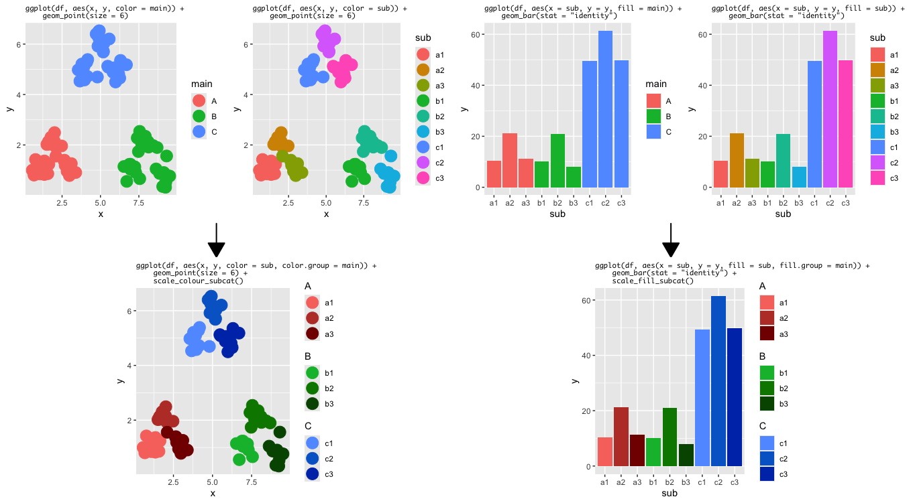

# Scales colors for sub-categorical variables for ggplot2

Admitting that human eyes cannot easily distinguish too many colors when we have many categories to be colored on a plot, a clever way is always in need. For the specific scenario where only a few categories exist while they can be sub-devided into many more sub-categories, this package proposes to distinguish the sub-categories within one main category by luminance (lightness) and chroma (intensity of color), while distinguishing main categories by different colors you can tell by words.

This package is dedicated to keep the grammer of graphics philosophy of ggplot2, so you can make the sub-categorical coloring happen as simply as adding an additional aesthetic and a scale to the call chain of ggplot2, with all other flexibility retained.

</img>

## Suggestions

This package is currently under development. Please feel free to open an issue if you have any suggestions or find any bugs.

## Installation

In an R session, run the following command:

```r
if (!requireNamespace("devtools", quietly = TRUE)) {
    install.packages("devtools")
}
devtools::install_github("mvfki/ggsubcat", build_vignettes = TRUE)
```

## Usage

Load minimum necessary packages:

```r
library(ggplot2)
library(ggsubcat)
```

Load example dataset:

```r
data("subcatPoints")
```

Generate the example plot:

```r
ggplot(subcatPoints, aes(x, y, color = sub, color.group = main)) +
    geom_point() +
    scale_color_subcat()
```

That's it!

Further customization and advanced usage will be updated in the vignette, which can be browsed in RStudio when running `vignette("ggsubcat")` (must have `build_vignettes = TRUE` added at `devtools::install_github()` call)
